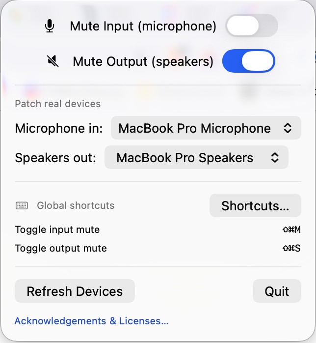
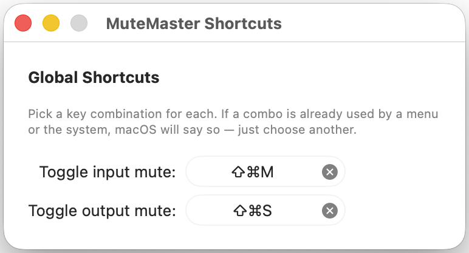

# MuteMaster

> A macOS menu-bar app that gives any call app a real "hardware mute" — global hotkeys for your mic and output that always win.

Works with any video-call app (Zoom, Meet, Slack huddles…). MuteMaster publishes two virtual audio
devices through a custom Core Audio driver and routes your real microphone/speakers through them — so
a global hotkey can cut your mic or your output regardless of what the call app's own mute button does.

```
                 ┌─────────────────────── MuteMaster app ───────────────────────┐
  Real Mic ─────▶│ capture ─▶ ring ─▶ [MUTE?] ─▶ play ─▶ "Mutable Microphone"  │──▶ Zoom reads mic
                 │                                          (virtual mic)        │
"Mutable Speaker"│ capture ─▶ ring ─▶ [MUTE?] ─▶ play ─▶ Real Speakers           │◀── Zoom writes audio
   (virtual)  ◀──│   ▲ (virtual speaker)                                         │
                 └────┴─────────────────────────────────────────────────────────┘
                   ▲ global hotkeys toggle [MUTE?]   ▲ menu-bar icons show state
```

In a call app you set **Microphone = "Mutable Microphone"** and **Speaker = "Mutable Speaker"**.
MuteMaster patches your real devices into/out of those, and the mute is enforced inside MuteMaster's
own audio engine.

## Features
- 🎙️ Virtual **Mutable Microphone** and 🔊 **Mutable Speaker** devices (custom Core Audio driver).
- 🔀 Patch any real mic → Mutable Microphone, and Mutable Speaker → any real speakers.
- ⌨️ User-configurable **global hotkeys** to toggle input/output mute (no Accessibility permission needed).
- 📊 Live mute state shown in the **menu bar** — mic / speaker SF Symbols that switch to a slashed, outlined variant when muted.
- 📦 In-app driver install via a privileged **SMAppService** helper.
- ✅ Tone-based **integration tests** — no human listening required.
- 🔓 Only open-source libraries ([KeyboardShortcuts](https://github.com/sindresorhus/KeyboardShortcuts), MIT) + Apple frameworks.

## Screenshots

The menu-bar icons always show the true mute state — mic and speaker, each flipping to a slashed
symbol the moment that path is muted:

| Live (unmuted) | Muted |
|:---:|:---:|
|  |  |

Clicking the menu-bar icon opens the panel — mute toggles, device patching, and the current global
shortcuts. Recording shortcuts happens in its own window:

| Menu panel | Shortcuts window |
|:---:|:---:|
|  |  |

## Repository layout
| Path | What |
|------|------|
| `MuteMasterDriver/` | The Core Audio HAL driver (AudioServerPlugIn, C). Publishes the two loopback devices. |
| `MuteMasterApp/` | The SwiftUI menu-bar app: routing engine, UI, hotkeys, installer. |
| `MuteMasterHelper/` | The privileged XPC helper that installs the driver. |
| `Shared/` | Code shared across targets: DSP, ring buffer, identifiers, XPC protocol. |
| `MuteMasterTests/` | DSP unit tests + tone-based audio integration tests. |
| `Vendor/KeyboardShortcuts/` | Vendored MIT global-hotkey library (local Swift package). |
| `Scripts/` | `build.sh`, `sign_and_install.sh`, `uninstall.sh`, `run_tests.sh`. |
| `project.yml` | XcodeGen spec — the Xcode project is generated from this. |

---

## Developer setup

### 1. Prerequisites
- **macOS 14+** (developed/tested on macOS 26, Apple Silicon).
- **Full Xcode** (not just Command Line Tools) — required to build the `.driver` bundle, the app,
  the helper, and to run the tests.
  - Install from the **Mac App Store** (search "Xcode"), or from
    [developer.apple.com/download](https://developer.apple.com/download/all/).
  - Point the toolchain at it and accept the license:
    ```sh
    sudo xcode-select -s /Applications/Xcode.app/Contents/Developer
    sudo xcodebuild -license accept
    xcodebuild -version          # expect Xcode 26.x
    ```
- **XcodeGen** (generates the Xcode project from `project.yml`):
  ```sh
  brew install xcodegen
  ```
- If SwiftPM ever fails with *"cannot use bare repository … safe.bareRepository is 'explicit'"*,
  that's a git 2.50 + Xcode clash. This repo sidesteps it by vendoring KeyboardShortcuts locally;
  no action needed.

### 2. Build
```sh
Scripts/build.sh
```
This runs `xcodegen generate` then `xcodebuild`, producing `build/Build/Products/Debug/MuteMasterApp.app`.
(Or open `MuteMaster.xcodeproj` in Xcode after `xcodegen generate` and press ⌘B.)

### 3. Install the driver (first run)
The virtual devices come from a HAL plug-in that must live in `/Library/Audio/Plug-Ins/HAL` (needs
admin). For development:
```sh
Scripts/sign_and_install.sh      # builds, ad-hoc signs, installs, restarts coreaudiod
```
Success prints the `Mutable Microphone` and `Mutable Speaker` devices. If they don't appear, diagnose with:
```sh
log show --predicate 'subsystem == "com.apple.coreaudio"' --last 2m --info --debug | grep -i mutemaster
```
> In the shipping app this same step is done by clicking **Install Driver** in the menu (which uses
> the SMAppService helper). The script is the developer fast-path / fallback.

### 4. Run
```sh
open build/Build/Products/Debug/MuteMasterApp.app
```
A mic+speaker icon appears in the menu bar. Grant microphone access when prompted. Click the icon to
pick your real devices and set hotkeys.

### 5. Test
```sh
Scripts/run_tests.sh
```
- **DSP unit tests** always run.
- **Audio integration tests** play a 1 kHz tone through the virtual devices and assert it's present
  when unmuted and absent when muted — they run for real once the driver is installed, and self-skip
  otherwise.

> 🔊 **Heads-up:** the integration tests generate a brief 1 kHz tone. It is routed only through the
> *virtual* devices (the app's real-speaker routing is disabled while tests run), so you normally
> won't hear it — but if you have other software monitoring the Mutable devices, consider lowering
> your volume before running the tests.

### 6. Uninstall the driver
To remove the virtual devices, delete the driver and restart Core Audio:
```sh
Scripts/uninstall.sh             # removes the driver, restarts coreaudiod (both need sudo)
```
This removes `MuteMasterDriver.driver` from `/Library/Audio/Plug-Ins/HAL`, so the **Mutable
Microphone** and **Mutable Speaker** devices disappear immediately. Any app (or this app) that had
them selected falls back to your default devices, and the audio integration tests will self-skip
afterward. Reinstall anytime with `Scripts/sign_and_install.sh`.

The privileged helper isn't removed by the script — to deregister it, remove **MuteMaster** from
**System Settings ▸ General ▸ Login Items**. Verify the devices are gone with:
```sh
system_profiler SPAudioDataType | grep -i Mutable   # prints nothing once uninstalled
```

### 7. Install on another Mac (portable build)
To run MuteMaster on **another Mac you control** without setting up notarization, build a portable
package:
```sh
Scripts/package-portable.sh      # → build/MuteMaster-portable.zip
```
This builds the app, ad-hoc signs the driver, and zips a self-contained payload:

| In the zip | Purpose |
|------------|---------|
| `MuteMasterApp.app` | the app |
| `MuteMasterDriver.driver` | the audio driver |
| `install.sh` | run on the target: strips the quarantine flag, installs the driver to `/Library/Audio/Plug-Ins/HAL`, restarts coreaudiod, copies the app to `/Applications`, and verifies the devices appeared |
| `INSTALL.txt` | the same steps in plain English |

Copy the zip to the target Mac, then:
```sh
unzip MuteMaster-portable.zip
bash MuteMaster-portable/install.sh      # prompts for your admin password (sudo)
```
Launch **MuteMaster** from `/Applications` — on first launch, right-click ▸ **Open** if Gatekeeper
warns. The only thing that makes this work without notarization is removing the `com.apple.quarantine`
flag (which `install.sh` does), so it's fine for **machines you own**.

> ⚠️ This ad-hoc, un-notarized build is for personal use only. **To distribute MuteMaster to other
> people**, you need a Developer ID–signed, notarized `.pkg` instead — asking others to bypass
> Gatekeeper isn't acceptable. If `coreaudiod` refuses the ad-hoc driver on the target's macOS
> version, that's your signal the notarized path is required.

---

## How it works (short version)
- **Driver** (`MuteMasterDriver/MuteMasterDriver.c`): an AudioServerPlugIn publishing two full-duplex
  *loopback* devices — audio written to a device's output stream is copied (via a ring buffer) to its
  input stream. Modeled on Apple's NullAudio sample with BlackHole-style loopback.
- **Routing engine** (`MuteMasterApp/Engine/`): two `AudioPath`s, each a capture AUHAL + a playback
  AUHAL connected by a lock-free ring buffer (`Shared/ZMRingBuffer.c`). AVAudioEngine can't span two
  devices, so we drive AUHAL directly.
- **Mute** lives in the engine's playback callback (`AUHALUnit.swift` → `renderCallback`): a single
  source of truth that works even if the call app ignores its own mute.
- **Hotkeys**: KeyboardShortcuts (Carbon `RegisterEventHotKey`) — needs no Accessibility permission.
- **Menu bar**: SwiftUI `MenuBarExtra` with SF Symbols bound to state.
- **Install**: `SMAppService` registers a root helper that copies the driver and restarts coreaudiod.

### A note on clock drift
The real device and the virtual device run on independent clocks. AUHAL resamples each to a common
48 kHz, but a few-ppm difference remains, so the ring buffer's fill level slowly drifts. The ring
bounds latency (overflow drops oldest audio, underrun inserts silence). For long calls this is fine
for voice; the highest-fidelity fix is varispeed/rate-scalar correction (Apple's CAPlayThrough model)
or an aggregate device with `kAudioSubDevicePropertyDriftCompensation` as the clock master — see
`Engine/AudioPath.swift` for where this would slot in.

---

## Troubleshooting
| Symptom | Fix |
|---------|-----|
| Devices don't appear after install | `sudo killall coreaudiod`; check `log show … com.apple.coreaudio … \| grep mutemaster`. |
| "Install Driver" asks for approval | Approve **MuteMaster** in System Settings ▸ General ▸ Login Items, then retry. |
| No audio through the virtual devices | Ensure you picked real input/output devices in the menu and granted mic access. |
| Tests skip the audio cases | The driver isn't installed — run `Scripts/sign_and_install.sh`. |

## Acknowledgements
With thanks to **Sindre Sorhus** and the **KeyboardShortcuts** contributors (the global-shortcuts
library we use), the **BlackHole** project by **ExistentialAudio** (whose loopback design inspired our
driver — no BlackHole code is included), and **Apple's NullAudio** sample (which shaped the driver's
structure). 🙏

## Trademarks
MuteMaster is **not affiliated with, endorsed by, or sponsored by** Zoom Video Communications, Inc.,
Google LLC, Slack Technologies, or any other company. "Zoom", "Google Meet", "Slack", and other
product names are trademarks of their respective owners and are referenced here only to describe
compatibility (nominative use).

## License
MuteMaster is licensed under the **MIT License** — see [`LICENSE`](LICENSE).

Third-party notices are in [`THIRD-PARTY-NOTICES.md`](THIRD-PARTY-NOTICES.md). The only bundled
third-party code is **KeyboardShortcuts** (MIT, vendored in `Vendor/KeyboardShortcuts/`). The driver
and ring buffer are original implementations inspired by Apple's NullAudio sample and BlackHole — no
code from those projects is included, so the GPL does not apply.
